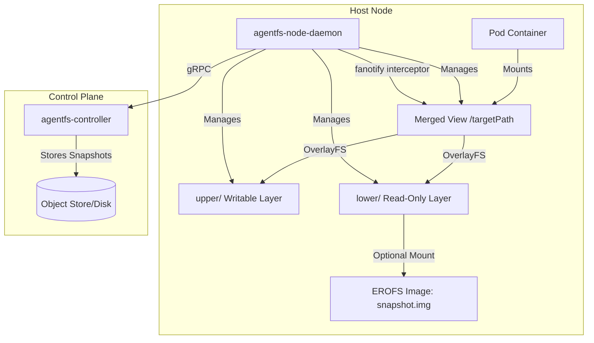
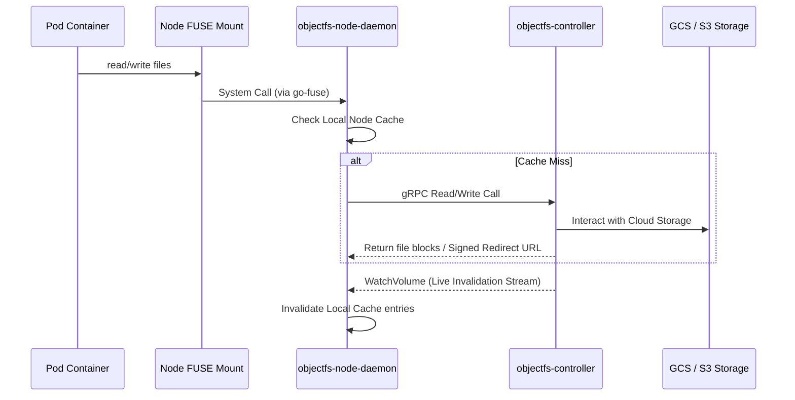
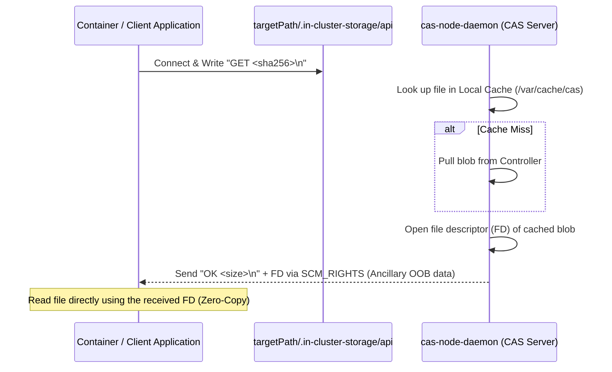
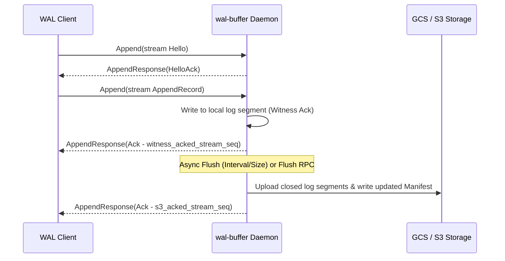

# Architecture

This document describes how components interact and data flows through the `in-cluster-storage` subsystems.

---

## 1. AgentFS (CSI & OverlayFS)

AgentFS operates via a Stateful Controller and a Node Daemon (CSI driver).

### Key Lifecycle Flows:
* **Mount (`NodePublishVolume`)**: Node Daemon downloads snapshot metadata. If EROFS is active, it mounts the snapshot image into `lower/` with one syscall. If lazy-loading is active, it sets up `fanotify` on the target directory and intercepts reads to lazily fetch missing files from the controller into `upper/`.
* **Unmount (`NodeUnpublishVolume`)**: Node Daemon scans *only* `upper/` to compute SHA256 hashes of modified or new files, uploads them to the controller, parses whiteouts to track deletions, and commits a delta snapshot.

---

## 2. ObjectFS (Credential-Isolated FUSE)

ObjectFS decouples object storage from node-level worker pods.

---

## 3. CAS (UDS with SCM_RIGHTS Zero-Copy)

For high-performance content addressable retrieval.

---

## 4. WAL Buffer (Segmented Record Streaming & Cloud Flush)

The WAL Buffer subsystem provides high-performance, low-latency write-ahead log buffering, committing to fast local storage before flushing to cloud object storage.

### Key Lifecycle Flows:
* **Append Streaming (`Append`)**: Bidirectional gRPC streams allow clients to write sequential records. The server persists them immediately to local, fast SSD segments (`witness` log) for ultra-low latency, and returns local confirmation.
* **Asynchronous Flushing (`Flush`)**: A background worker uploads local log segments to cloud storage and publishes a new manifest, at which point the server returns the permanent `s3_acked` sequence to the stream clients.
* **Streaming Consumers (`Tail`)**: Clients tail the log from a specified position. Unflushed records are provisional; if a client disconnects and reconnects, they resume from the last flushed position and deduplicate redelivered records in-memory using `(stream_id, stream_seq)`.

